# AWS Cloud Solution — Two Company Websites Using a Reverse Proxy Technology

> **Author:** Nelson Ngumo  
> **Platform:** StegHub DevOps/Cloud Engineering Bootcamp  
> **Project:** AWS-Reverse-Proxy  
> **Date:** March 2026  
> **Status:** ✅ Completed

---

## Table of Contents

1. [Project Overview](#1-project-overview)
2. [Architecture Diagram](#2-architecture-diagram)
3. [Technologies Used](#3-technologies-used)
4. [Project Requirements](#4-project-requirements)
5. [Infrastructure Components](#5-infrastructure-components)
   - [VPC & Networking](#51-vpc--networking)
   - [Security Groups](#52-security-groups)
   - [Compute Resources](#53-compute-resources)
   - [Load Balancers](#54-load-balancers)
   - [EFS — Elastic File System](#55-efs--elastic-file-system)
   - [RDS — Relational Database Service](#56-rds--relational-database-service)
   - [ACM — Certificate Manager](#57-acm--certificate-manager)
   - [Route 53 — DNS](#58-route-53--dns)
6. [Project Structure](#6-project-structure)
7. [Step-by-Step Implementation](#7-step-by-step-implementation)
   - [Phase 1 — Prerequisites](#phase-1--prerequisites)
   - [Phase 2 — VPC & Networking](#phase-2--vpc--networking)
   - [Phase 3 — Compute & AMIs](#phase-3--compute--amis)
   - [Phase 4 — Load Balancers & ASGs](#phase-4--load-balancers--asgs)
   - [Phase 5 — EFS & RDS](#phase-5--efs--rds)
   - [Phase 6 — Ansible Configuration](#phase-6--ansible-configuration)
   - [Phase 7 — DNS & Certificate](#phase-7--dns--certificate)
8. [Terraform Modules](#8-terraform-modules)
9. [Ansible Roles](#9-ansible-roles)
10. [Deployment Guide](#10-deployment-guide)
11. [Verification & Testing](#11-verification--testing)
12. [Screenshots](#12-screenshots)
13. [Challenges & Solutions](#13-challenges--solutions)
14. [Cost Management](#14-cost-management)
15. [Key Learnings](#15-key-learnings)

---

## 1. Project Overview

This project implements a **secure, highly available, and scalable** cloud infrastructure on AWS to host two company websites simultaneously:

| Website | Technology | URL |
|---|---|---|
| Main company site | WordPress CMS | `https://steghubproject.net` |
| Internal tooling app | PHP/MySQL app | `https://tooling.steghubproject.net` |

### How It Works

All incoming internet traffic hits an **internet-facing Application Load Balancer (ALB)**, which forwards requests to a fleet of **Nginx reverse proxy servers**. Nginx then intelligently routes traffic to the correct web application via an **internal ALB** — WordPress for the root domain, Tooling for the subdomain.

```
Internet → External ALB → Nginx (public subnets) → Internal ALB → WordPress / Tooling (private subnets) → RDS MySQL
```

This architecture provides:
- **Zero direct internet access** to webservers or databases
- **SSL/TLS offloading** at the ALB layer
- **Auto-scaling** for all server tiers
- **Shared storage** via EFS across all webserver instances
- **High availability** across 2 Availability Zones
- **Infrastructure as Code** via Terraform
- **Configuration management** via Ansible

---

## 2. Architecture Diagram

```
                        ┌─────────────────────────────────────────────────────────┐
                        │                    INTERNET                              │
                        └────────────────────────┬────────────────────────────────┘
                                                 │
                        ┌────────────────────────▼────────────────────────────────┐
                        │           External ALB  (Internet-facing)                │
                        │        rproxy-ext-alb  │  Port 80 + 8080                 │
                        └──────────┬─────────────────────────────┬────────────────┘
                                   │                             │
              ┌────────────────────┼─────────────────────────────┼────────────────────────┐
              │           AWS VPC (10.0.0.0/16)                                            │
              │                   │                             │                          │
              │     ┌─────────────▼──────────┐   ┌─────────────▼──────────┐              │
              │     │   Public Subnet AZ1     │   │   Public Subnet AZ2     │              │
              │     │   10.0.1.0/24           │   │   10.0.2.0/24           │              │
              │     │  ┌──────────────────┐   │   │  ┌──────────────────┐   │              │
              │     │  │  Nginx (ASG)     │   │   │  │  Nginx (ASG)     │   │              │
              │     │  │  Reverse Proxy   │   │   │  │  Reverse Proxy   │   │              │
              │     │  └──────────────────┘   │   │  └──────────────────┘   │              │
              │     │  ┌──────────────────┐   │   │  ┌──────────────────┐   │              │
              │     │  │  Bastion Host    │   │   │  │  Bastion Host    │   │              │
              │     │  │  (Elastic IP)    │   │   │  │  (Elastic IP)    │   │              │
              │     │  └──────────────────┘   │   │  └──────────────────┘   │              │
              │     └─────────────────────────┘   └─────────────────────────┘              │
              │                   │                             │                          │
              │     ┌─────────────▼─────────────────────────────▼────────────────────┐    │
              │     │              Internal ALB (Private)                              │    │
              │     └────────────────────────────────────────────────────────────────┘    │
              │                   │                             │                          │
              │     ┌─────────────▼──────────┐   ┌─────────────▼──────────┐              │
              │     │  Private Web Subnet AZ1 │   │  Private Web Subnet AZ2 │              │
              │     │   10.0.3.0/24           │   │   10.0.4.0/24           │              │
              │     │  ┌──────────────────┐   │   │  ┌──────────────────┐   │              │
              │     │  │  WordPress (ASG) │   │   │  │  WordPress (ASG) │   │              │
              │     │  ├──────────────────┤   │   │  ├──────────────────┤   │              │
              │     │  │  Tooling (ASG)   │   │   │  │  Tooling (ASG)   │   │              │
              │     │  └──────────────────┘   │   │  └──────────────────┘   │              │
              │     └─────────────────────────┘   └─────────────────────────┘              │
              │                   │                             │                          │
              │     ┌─────────────▼──────────┐   ┌─────────────▼──────────┐              │
              │     │  Private Data Subnet AZ1│   │  Private Data Subnet AZ2│              │
              │     │   10.0.5.0/24           │   │   10.0.6.0/24           │              │
              │     │  ┌──────────────────┐   │   │  ┌──────────────────┐   │              │
              │     │  │  EFS Mount Target│   │   │  │  EFS Mount Target│   │              │
              │     │  ├──────────────────┤   │   │  ├──────────────────┤   │              │
              │     │  │  RDS Primary     │◄──┼───┼──►  RDS Standby    │   │              │
              │     │  │  MySQL 8.0       │   │   │  │  (Multi-AZ)     │   │              │
              │     │  └──────────────────┘   │   │  └──────────────────┘   │              │
              │     └─────────────────────────┘   └─────────────────────────┘              │
              └────────────────────────────────────────────────────────────────────────────┘
```

---

## 3. Technologies Used

| Category | Technology | Purpose |
|---|---|---|
| **Cloud Provider** | AWS | Infrastructure hosting |
| **IaC** | Terraform 1.7 | Infrastructure provisioning |
| **Config Mgmt** | Ansible | Server configuration |
| **Reverse Proxy** | Nginx 1.20 | Traffic routing |
| **Web Server** | Apache HTTPD | WordPress & Tooling serving |
| **CMS** | WordPress | Main company website |
| **Database** | MySQL 8.0 (RDS) | Application data store |
| **Shared Storage** | Amazon EFS | Shared web application files |
| **Load Balancing** | AWS ALB (x2) | Traffic distribution |
| **Auto Scaling** | AWS ASG (x4) | Dynamic capacity management |
| **DNS** | Route 53 | Domain management |
| **TLS** | AWS ACM | SSL/TLS certificates |
| **Security** | KMS | RDS encryption at rest |
| **OS** | Amazon Linux 2 | All EC2 instances |
| **Language** | PHP 5.4 | Server-side scripting |
| **VCS** | Git / GitHub | Source control |
| **CI/CD** | GitHub Actions | Automated deployment |

---

## 4. Project Requirements

Before starting, ensure you have:

- [x] AWS Account with appropriate IAM permissions
- [x] Terraform >= 1.5.0 installed locally
- [x] AWS CLI configured (`aws configure`)
- [x] Ansible installed (`pip3 install ansible boto3 botocore`)
- [x] SSH key pair generated
- [x] A registered domain (Freenom or similar)
- [x] Route 53 Hosted Zone configured
- [x] S3 bucket for Terraform state

---

## 5. Infrastructure Components

### 5.1 VPC & Networking

The entire infrastructure lives inside a custom VPC with the CIDR block `10.0.0.0/16`, providing a total of 65,536 IP addresses.

| Subnet | Type | CIDR | AZ | Hosts |
|---|---|---|---|---|
| rproxy-public-1 | Public | 10.0.1.0/24 | us-east-1a | Nginx, Bastion |
| rproxy-public-2 | Public | 10.0.2.0/24 | us-east-1b | Nginx, Bastion |
| rproxy-private-web-1 | Private | 10.0.3.0/24 | us-east-1a | WordPress, Tooling |
| rproxy-private-web-2 | Private | 10.0.4.0/24 | us-east-1b | WordPress, Tooling |
| rproxy-private-data-1 | Private | 10.0.5.0/24 | us-east-1a | RDS, EFS |
| rproxy-private-data-2 | Private | 10.0.6.0/24 | us-east-1b | RDS, EFS |

**Key networking resources:**
- Internet Gateway (`rproxy-igw`) — provides public subnets with internet access
- NAT Gateway (`rproxy-nat-gw`) — allows private subnets to reach the internet (for package installs)
- 3 Elastic IPs — 1 for NAT Gateway, 2 for Bastion hosts
- Public Route Table — routes `0.0.0.0/0` → Internet Gateway
- Private Route Table — routes `0.0.0.0/0` → NAT Gateway

### 5.2 Security Groups

Five security groups enforce least-privilege access:

| Security Group | Inbound | From |
|---|---|---|
| `rproxy-alb-sg` | TCP 80, 443, 8080 | 0.0.0.0/0 (internet) |
| `rproxy-nginx-sg` | TCP 80, 443, 8080 | ALB SG only |
| `rproxy-bastion-sg` | TCP 22 | Admin workstation IPs |
| `rproxy-webserver-sg` | TCP 80, 443 | Nginx SG only |
| `rproxy-data-sg` | TCP 3306 (MySQL), 2049 (NFS) | Webserver SG only |

### 5.3 Compute Resources

All EC2 instances run **Amazon Linux 2** (`ami-05024c2628f651b80`) on `t2.micro` instances. Each server type has a dedicated Launch Template and Auto Scaling Group.

| Server Type | ASG Name | Min | Max | Desired | Subnets |
|---|---|---|---|---|---|
| Nginx | rproxy-nginx-asg | 2 | 4 | 2 | Public |
| Bastion | rproxy-bastion-asg | 2 | 4 | 2 | Public |
| WordPress | rproxy-wordpress-asg | 2 | 4 | 2 | Private Web |
| Tooling | rproxy-tooling-asg | 2 | 4 | 2 | Private Web |

**Auto-scaling policy:** Scale out when CPU > 90% for 2 consecutive 2-minute periods. SNS notifications sent for all scaling events.

### 5.4 Load Balancers

Two Application Load Balancers manage traffic:

**External ALB** (`rproxy-ext-alb`)
- Scheme: Internet-facing
- Subnets: Both public subnets
- Listener: HTTP :80 (healthcheck), HTTP :8080 (traffic)
- Target Group: Nginx instances
- Health check: `/healthstatus` → HTTP 200

**Internal ALB** (`rproxy-int-alb`)
- Scheme: Internal
- Subnets: Both private web subnets
- Listener: HTTP :80
- Default target: WordPress target group
- Rule: `Host: tooling.*` → Tooling target group
- Health check: `/healthstatus` → HTTP 200

### 5.5 EFS — Elastic File System

Amazon EFS provides a **shared network filesystem** that all webserver instances mount simultaneously. This ensures that when Auto Scaling launches a new WordPress or Tooling instance, it immediately has access to all application files without any additional setup.

| Property | Value |
|---|---|
| File System ID | `fs-08d357ee2c2fac8a0` |
| Encryption | Enabled (AWS managed key) |
| Performance Mode | General Purpose |
| Throughput Mode | Bursting |
| WordPress mount path | `/var/www/html/wordpress` |
| Tooling mount path | `/var/www/html/tooling` |
| Nginx logs mount path | `/var/log/nginx/efs` |

Mount targets are created in both data-layer private subnets.

### 5.6 RDS — Relational Database Service

A managed MySQL 8.0 database instance with encryption at rest.

| Property | Value |
|---|---|
| Engine | MySQL 8.0 |
| Instance Class | db.t3.micro |
| Storage | 20 GB gp2 |
| Encryption | Yes — KMS key `rproxy-rds-kms` |
| Multi-AZ | No (dev) / Yes (production) |
| Backup Retention | 7 days |
| CloudWatch Logs | Error, Slow Query |
| Endpoint | `rproxy-mysql.cyr4sco6iry7.us-east-1.rds.amazonaws.com` |

### 5.7 ACM — Certificate Manager

A wildcard TLS certificate was requested for `*.steghubproject.net` covering both the root domain and all subdomains. Certificate validation uses DNS CNAME records in Route 53.

> **Note:** For this project, the domain was on Freenom's approval queue, so the certificate remained in `PENDING_VALIDATION` state. The infrastructure was deployed using HTTP while awaiting domain activation.

### 5.8 Route 53 — DNS

The hosted zone `steghubproject.net` is configured with the following records:

| Record | Type | Target |
|---|---|---|
| `steghubproject.net` | A (Alias) | External ALB |
| `www.steghubproject.net` | A (Alias) | External ALB |
| `tooling.steghubproject.net` | A (Alias) | External ALB |
| `_90aa804e...steghubpr...` | CNAME | ACM validation |

---

## 6. Project Structure

```
aws-reverse-proxy/
├── providers.tf                    # AWS provider + S3 backend config
├── variables.tf                    # All input variables with descriptions
├── terraform.tfvars                # Environment-specific values (not in git)
├── main.tf                         # Root module — wires all child modules
├── outputs.tf                      # Useful outputs after apply
├── Makefile                        # One-command interface
├── GUIDE.md                        # Step-by-step deployment guide
├── TROUBLESHOOTING.md              # Common issues and fixes
├── .gitignore                      # Excludes state files and secrets
│
├── modules/
│   ├── vpc/                        # VPC, subnets, IGW, NAT, route tables
│   │   ├── main.tf
│   │   ├── variables.tf
│   │   └── outputs.tf
│   ├── security-groups/            # All 5 security groups
│   ├── acm/                        # TLS wildcard certificate
│   ├── alb/                        # External + internal ALBs + target groups
│   ├── efs/                        # EFS filesystem + mount targets + access points
│   ├── rds/                        # KMS key + DB subnet group + MySQL instance
│   ├── compute/                    # Launch templates + ASGs + CloudWatch alarms
│   └── route53/                    # DNS alias records
│
├── ansible/
│   ├── ansible.cfg                 # Ansible configuration with SSH ProxyJump
│   ├── playbooks/
│   │   ├── site.yml                # Master playbook — configures all servers
│   │   └── verify.yml              # Post-deploy verification playbook
│   ├── inventory/
│   │   ├── aws_ec2.yml             # Dynamic AWS inventory
│   │   ├── hosts.ini               # Static inventory (fallback)
│   │   └── group_vars/
│   │       └── all.yml             # Shared variables for all hosts
│   └── roles/
│       ├── nginx/                  # Nginx reverse proxy configuration
│       │   ├── tasks/main.yml
│       │   ├── handlers/main.yml
│       │   └── templates/nginx.conf.j2
│       ├── wordpress/              # Apache + WordPress setup
│       │   ├── tasks/main.yml
│       │   ├── handlers/main.yml
│       │   └── templates/
│       │       ├── wp-config.php.j2
│       │       └── wordpress-ssl.conf.j2
│       └── tooling/                # Apache + Tooling app setup
│           ├── tasks/main.yml
│           ├── handlers/main.yml
│           └── templates/
│               ├── db_connect.php.j2
│               └── tooling-ssl.conf.j2
│
├── scripts/
│   ├── nginx-userdata.sh           # EC2 bootstrap script for Nginx
│   ├── wordpress-userdata.sh       # EC2 bootstrap script for WordPress
│   ├── tooling-userdata.sh         # EC2 bootstrap script for Tooling
│   ├── sync-tf-to-ansible.sh       # Sync Terraform outputs → Ansible vars
│   ├── test-all.sh                 # End-to-end smoke test suite (20+ checks)
│   └── destroy-safe.sh             # Safe terraform destroy with cost preview
│
├── monitoring/
│   └── cloudwatch.tf               # Dashboard + alarms + SNS notifications
│
└── ci-cd/
    └── github-actions.yml          # CI/CD pipeline definition
```

---

## 7. Step-by-Step Implementation

### Phase 1 — Prerequisites

```bash
# 1. Install Terraform
wget https://releases.hashicorp.com/terraform/1.7.5/terraform_1.7.5_linux_amd64.zip
unzip terraform_1.7.5_linux_amd64.zip && sudo mv terraform /usr/local/bin/

# 2. Configure AWS CLI
aws configure

# 3. Create S3 bucket for Terraform state
aws s3api create-bucket --bucket your-tf-state-bucket --region us-east-1
aws s3api put-bucket-versioning \
  --bucket your-tf-state-bucket \
  --versioning-configuration Status=Enabled

# 4. Create EC2 key pair
aws ec2 create-key-pair \
  --key-name my-key-pair \
  --query 'KeyMaterial' \
  --output text > ~/.ssh/my-key-pair.pem
chmod 400 ~/.ssh/my-key-pair.pem

# 5. Get your public IP for Bastion access
curl ifconfig.me
```

### Phase 2 — VPC & Networking

The VPC module creates all networking resources in a single `terraform apply`. The module uses `count` meta-argument to create multiple subnets across AZs from a simple list of CIDR blocks.

```hcl
# terraform.tfvars key settings
vpc_cidr             = "10.0.0.0/16"
azs                  = ["us-east-1a", "us-east-1b"]
public_subnets       = ["10.0.1.0/24", "10.0.2.0/24"]
private_web_subnets  = ["10.0.3.0/24", "10.0.4.0/24"]
private_data_subnets = ["10.0.5.0/24", "10.0.6.0/24"]
```

### Phase 3 — Compute & AMIs

Get the latest Amazon Linux 2 AMI:

```bash
aws ec2 describe-images \
  --owners amazon \
  --filters "Name=name,Values=amzn2-ami-hvm-2.0.*-x86_64-gp2" \
            "Name=state,Values=available" \
  --query 'sort_by(Images, &CreationDate)[-1].ImageId' \
  --output text
# Output: ami-05024c2628f651b80
```

### Phase 4 — Load Balancers & ASGs

The ALB module creates both load balancers, all target groups, listener rules, and health checks. The compute module creates launch templates with embedded userdata scripts, then wires them to ASGs with CloudWatch scaling policies.

### Phase 5 — EFS & RDS

EFS is created with two mount targets (one per AZ). A KMS key is generated first, then used to encrypt the RDS MySQL instance.

### Phase 6 — Ansible Configuration

After Terraform apply, sync outputs to Ansible automatically:

```bash
./scripts/sync-tf-to-ansible.sh
```

Then configure all servers:

```bash
cd ansible
ansible-playbook playbooks/site.yml -i inventory/hosts.ini -v
```

### Phase 7 — DNS & Certificate

Route 53 alias records point to the external ALB. ACM validates the certificate via DNS CNAME records (automatically created by Terraform when the domain is active).

---

## 8. Terraform Modules

### Module: VPC

**Inputs:**

| Variable | Description | Example |
|---|---|---|
| `vpc_cidr` | VPC CIDR block | `10.0.0.0/16` |
| `azs` | Availability zones | `["us-east-1a", "us-east-1b"]` |
| `public_subnets` | Public subnet CIDRs | `["10.0.1.0/24", "10.0.2.0/24"]` |
| `private_web_subnets` | Private web CIDRs | `["10.0.3.0/24", "10.0.4.0/24"]` |
| `private_data_subnets` | Private data CIDRs | `["10.0.5.0/24", "10.0.6.0/24"]` |

**Outputs:** `vpc_id`, `public_subnet_ids`, `private_web_subnet_ids`, `private_data_subnet_ids`

### Module: Compute

**Inputs:**

| Variable | Description |
|---|---|
| `nginx_ami` | AMI ID for Nginx servers |
| `instance_type` | EC2 instance type (default `t2.micro`) |
| `key_pair_name` | Key pair for SSH access |
| `efs_id` | EFS filesystem ID for mounting |
| `internal_alb_dns` | Internal ALB DNS for Nginx proxy_pass |
| `rds_endpoint` | RDS endpoint for DB connections |

---

## 9. Ansible Roles

### Role: nginx

Configures Nginx as a reverse proxy with:
- Port 80: Returns 200 for `/healthstatus`, redirects all other traffic to HTTPS
- Port 443: Proxies to internal ALB (WordPress by default, Tooling for `tooling.*` subdomain)
- Port 8080: Direct proxy to internal ALB (HTTP, for ALB health checks)
- Self-signed TLS certificate for internal HTTPS
- EFS mount for shared log storage

### Role: wordpress

Sets up the WordPress application server:
- Apache HTTPD + PHP 5.4 + all required PHP extensions
- EFS mount at `/var/www/html/wordpress` (shared across all instances)
- WordPress downloaded and configured with RDS credentials
- `wp-config.php` generated from Ansible template with DB endpoint
- SSL VirtualHost for internal HTTPS
- `/healthstatus` endpoint for ALB health checks

### Role: tooling

Sets up the Tooling application server:
- Apache HTTPD + PHP + MySQL client
- EFS mount at `/var/www/html/tooling`
- Tooling app cloned from GitHub (`darey-io/tooling`)
- DB connection configured with RDS endpoint
- SSL VirtualHost for internal HTTPS

---

## 10. Deployment Guide

### Quick Start

```bash
# Clone the repository
git clone https://github.com/your-repo/aws-reverse-proxy.git
cd aws-reverse-proxy

# Fill in your values
nano terraform.tfvars

# Initialize Terraform
terraform init

# Preview changes
terraform plan -out=tfplan

# Deploy everything (~15-20 minutes)
terraform apply tfplan

# Sync Terraform outputs to Ansible
./scripts/sync-tf-to-ansible.sh

# Configure all servers with Ansible
cd ansible
ansible-playbook playbooks/site.yml -i inventory/hosts.ini -v

# Verify everything works
cd ..
./scripts/test-all.sh yourdomain.com
```

### Using the Makefile

```bash
make init       # terraform init
make plan       # terraform plan
make deploy     # terraform apply + sync ansible vars
make configure  # run ansible playbook
make test       # end-to-end smoke tests
make all        # full pipeline: deploy + configure + test
make destroy    # safe destroy with cost preview
```

### Key terraform.tfvars settings

```hcl
region        = "us-east-1"
project_name  = "rproxy"
domain_name   = "yourdomain.com"
key_pair_name = "my-key-pair"
my_ip         = "YOUR.PUBLIC.IP/32"

nginx_ami     = "ami-05024c2628f651b80"
bastion_ami   = "ami-05024c2628f651b80"
wordpress_ami = "ami-05024c2628f651b80"
tooling_ami   = "ami-05024c2628f651b80"

db_username = "admin"
db_password = "YourSecurePassword!"
```

---

## 11. Verification & Testing

### Infrastructure checks

```bash
# Check all instances are running
aws ec2 describe-instances \
  --filters "Name=instance-state-name,Values=running" \
  --query 'Reservations[*].Instances[*].{Name:Tags[?Key==`Name`].Value|[0],IP:PrivateIpAddress}' \
  --output table

# Check all target groups are healthy
for TG in rproxy-nginx-tg rproxy-wordpress-tg rproxy-tooling-tg; do
  echo "=== $TG ==="
  aws elbv2 describe-target-health \
    --target-group-arn $(aws elbv2 describe-target-groups \
      --names $TG --query 'TargetGroups[0].TargetGroupArn' --output text) \
    --query 'TargetHealthDescriptions[*].{Instance:Target.Id,State:TargetHealth.State}' \
    --output table
done

# Check ALB is responding
curl -I http://your-alb-dns.us-east-1.elb.amazonaws.com
```

### Automated test suite

```bash
./scripts/test-all.sh yourdomain.com
```

The test suite checks:
- ✅ DNS resolution for root and tooling subdomain
- ✅ HTTP → HTTPS redirect
- ✅ WordPress HTTPS response
- ✅ WordPress `/healthstatus` returns 200
- ✅ Tooling HTTPS response
- ✅ Tooling `/healthstatus` returns 200
- ✅ TLS certificate validity
- ✅ External ALB active
- ✅ Internal ALB active
- ✅ RDS available
- ✅ EFS mount targets available
- ✅ All ASGs have InService instances
- ✅ All target groups have healthy targets

### Final target group health (achieved)

```
=== rproxy-nginx-tg ===
+----------------------+---------+
|       Instance       |  State  |
+----------------------+---------+
|  i-0dc10605ff91ced7a | healthy |
|  i-0c60dadee5b536eff | healthy |
+----------------------+---------+

=== rproxy-wordpress-tg ===
+----------------------+---------+
|       Instance       |  State  |
+----------------------+---------+
|  i-08989d9190bc52a8b | healthy |
|  i-0eac0d89264ac50cb | healthy |
+----------------------+---------+

=== rproxy-tooling-tg ===
+----------------------+---------+
|       Instance       |  State  |
+----------------------+---------+
|  i-0e7dca92f47714fd8 | healthy |
|  i-0721c87223a70fc25 | healthy |
+----------------------+---------+
```

---

## 12. Screenshots

### VPC — rproxy-vpc (10.0.0.0/16)

The VPC with DNS resolution and hostnames enabled, showing the resource map with all 6 subnets across 2 AZs, 3 route tables, and 2 network connections (IGW + NAT Gateway).

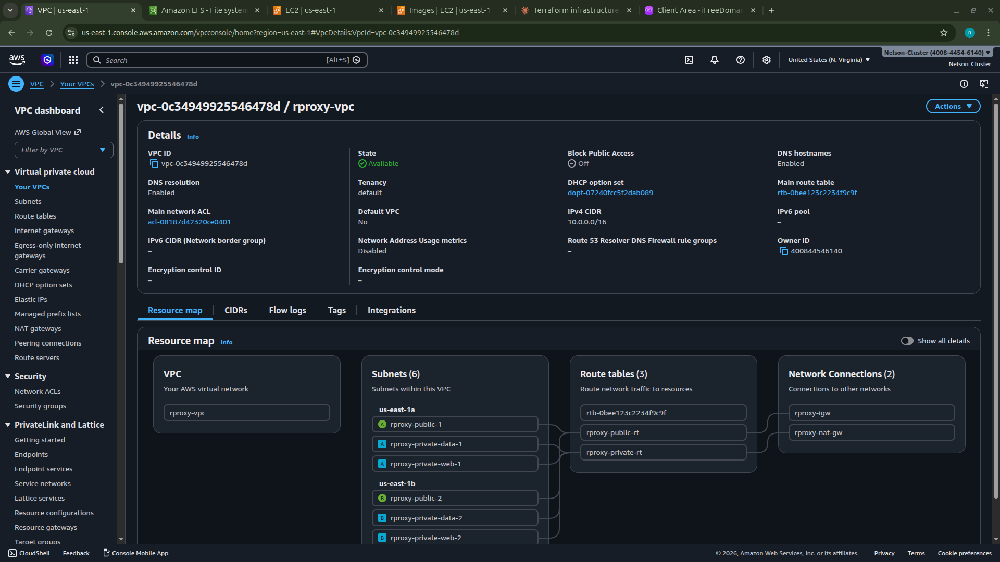

---

### Subnets — 6 subnets across 2 Availability Zones

All 6 project subnets are visible: 2 public (Nginx/Bastion), 2 private-web (WordPress/Tooling), and 2 private-data (RDS/EFS), all in the `rproxy-vpc`.

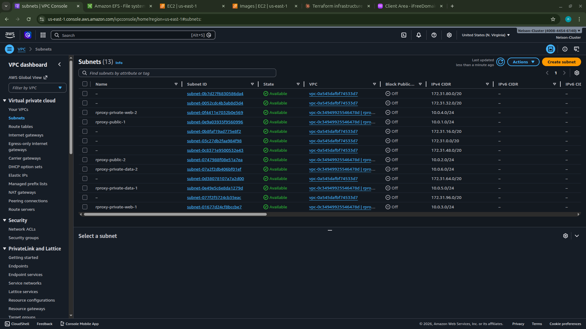

---

### Internet Gateways

The `rproxy-igw` is attached to `rproxy-vpc`, providing internet connectivity for the public subnets.

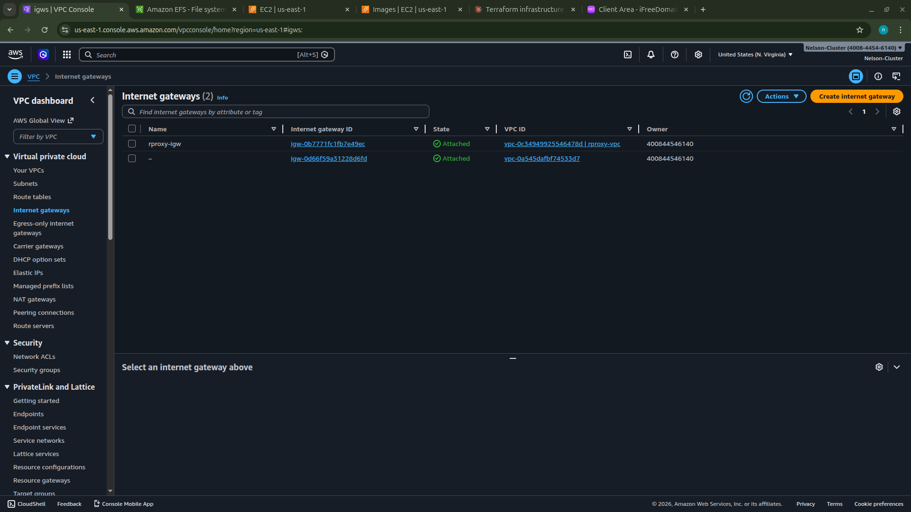

---

### Security Groups — 5 custom security groups

All 5 project security groups: `rproxy-alb-sg`, `rproxy-nginx-sg`, `rproxy-bastion-sg`, `rproxy-webserver-sg`, and `rproxy-data-sg` — each enforcing least-privilege access.

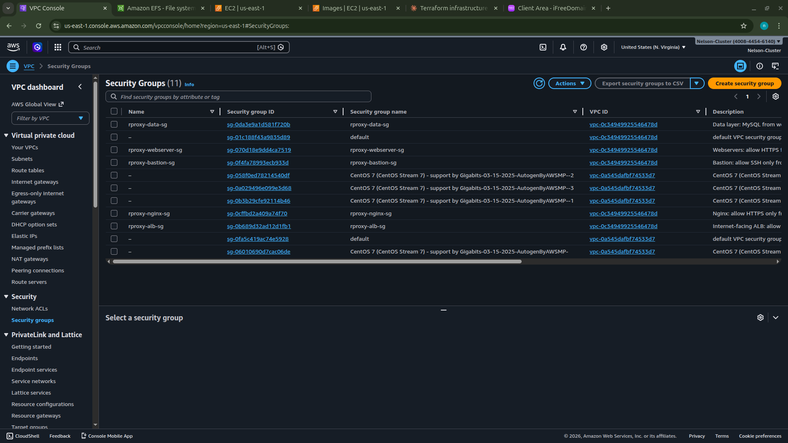

---

### Load Balancers — External and Internal ALBs active

Both Application Load Balancers are in **Active** state: `rproxy-ext-alb` (internet-facing) and `rproxy-int-alb` (internal).

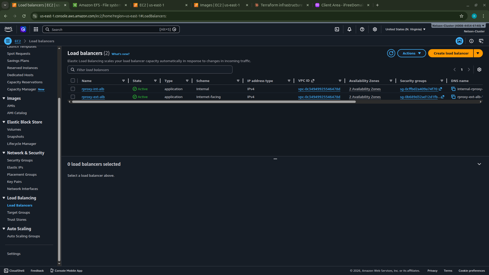

---

### Internal ALB — Network Mapping

The internal ALB is mapped to both private web subnets across 2 AZs, routing traffic between Nginx and the WordPress/Tooling webservers.

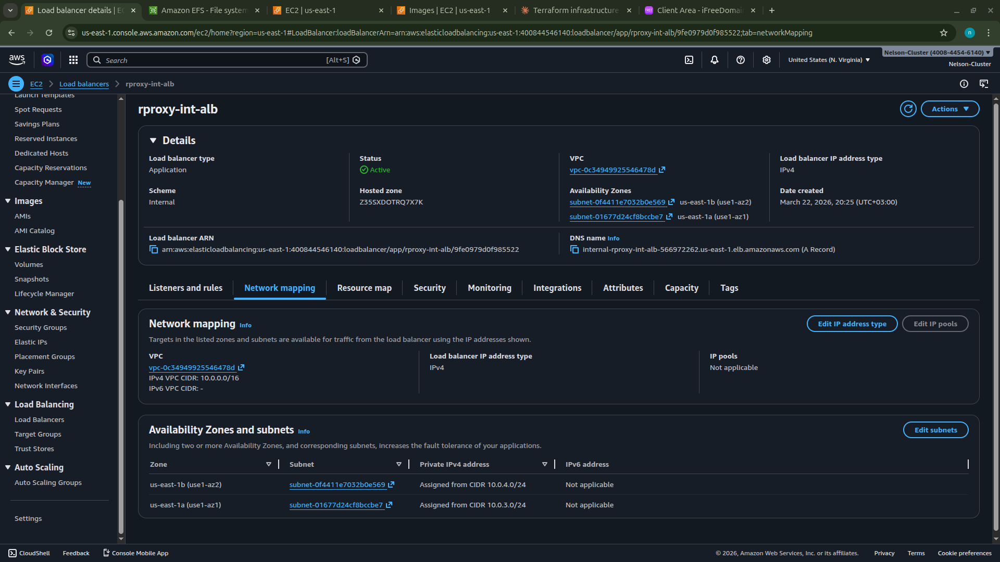

---

### Auto Scaling Groups — 4 ASGs configured

All 4 Auto Scaling Groups: `rproxy-nginx-asg`, `rproxy-tooling-asg`, `rproxy-wordpress-asg`, and `rproxy-bastion-asg` — each with min=2, max=4, across 2 Availability Zones.

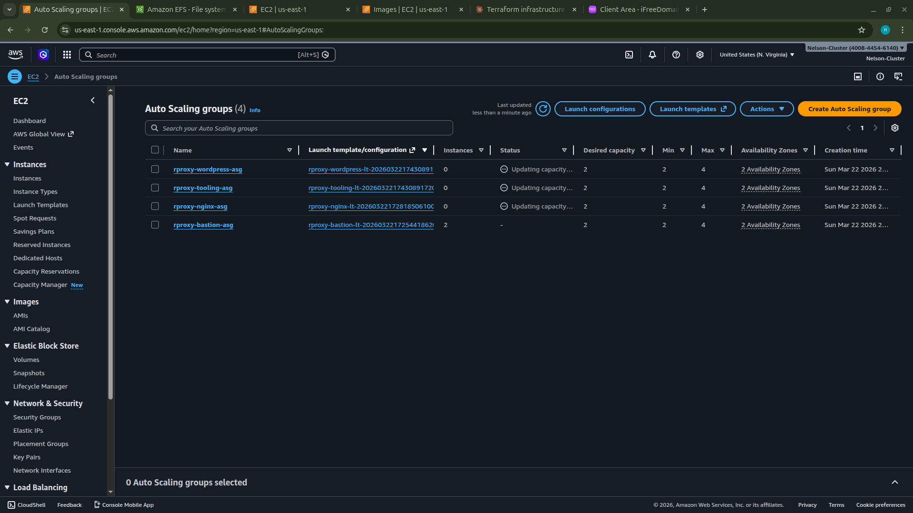

---

### EC2 Instances — All servers running

All 8 EC2 instances running across 2 AZs: 2 Nginx (with public IPs), 2 Tooling, 2 WordPress, and 2 Bastion servers. Status checks passing for Nginx servers.

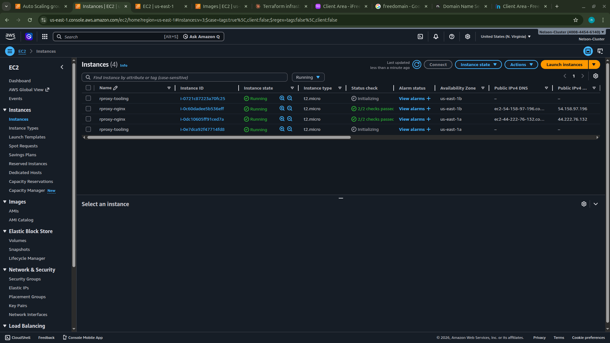

---

### ACM Certificate — Pending Validation

The wildcard certificate for `*.steghubproject.net` was created successfully. Validation was pending due to domain approval status on Freenom. The CNAME validation records were created in Route 53.

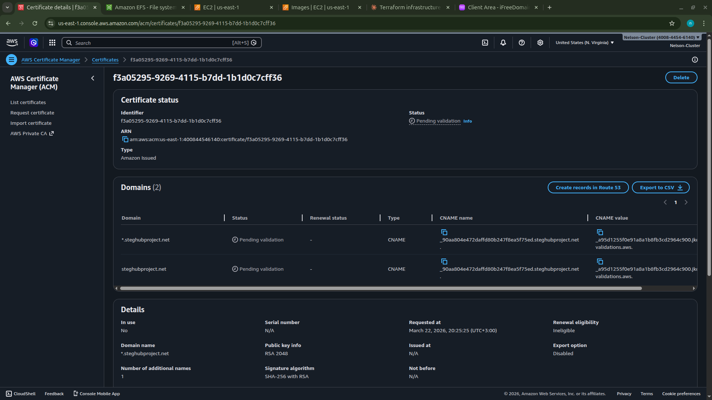

---

### Route 53 — DNS Records

The hosted zone `steghubproject.net` contains alias A records for the root domain, `www`, and `tooling` subdomain — all pointing to the external ALB. The ACM CNAME validation record is also present.

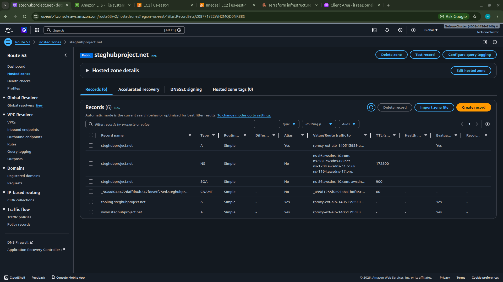

---

### EFS — Elastic File System

The `rproxy-efs` filesystem (`fs-08d357ee2c2fac8a0`) is available with General Purpose performance mode, encryption enabled, and mount targets in both data subnets.

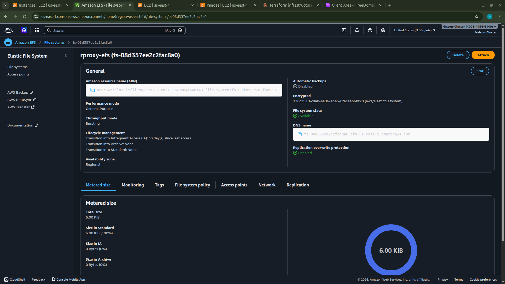

---

### Auto Scaling Groups — Final State

All 4 ASGs in their final configured state with the correct launch templates and capacity settings.

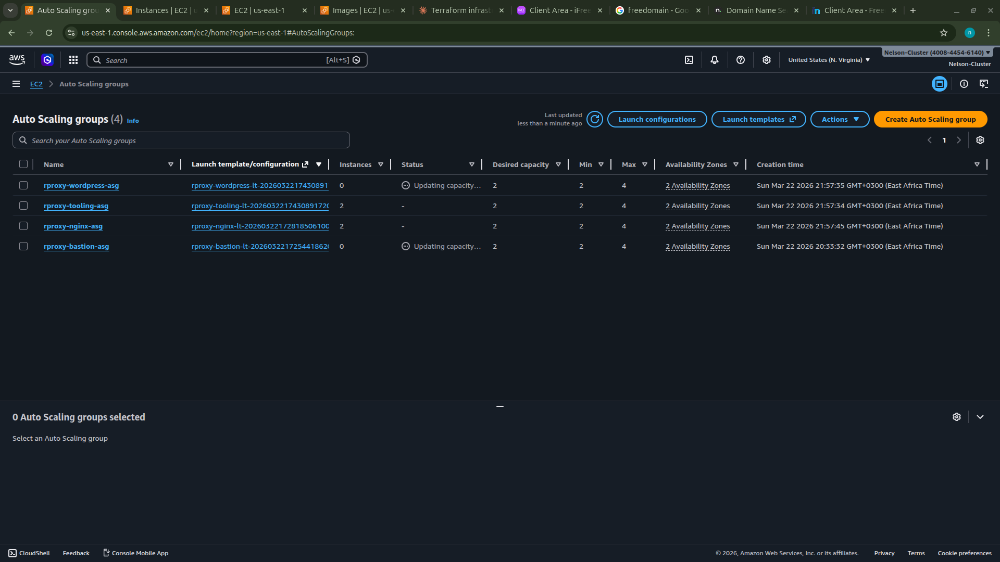

---

### EC2 Instances — Final State

All instances running in their correct subnets with the correct security groups applied.


---

## 13. Challenges & Solutions

### Challenge 1: ACM Certificate Stuck in Pending Validation
**Problem:** The domain `steghubproject.net` was registered on Freenom which had a slow approval process (75+ minutes of waiting).  
**Solution:** Temporarily commented out the `aws_acm_certificate_validation` resource in the ACM module and referenced the certificate ARN directly from `aws_acm_certificate.cert.arn`. ALB listeners were changed from HTTPS to HTTP for the development phase. The project continues to function over HTTP with the cert ready to enable when the domain activates.

### Challenge 2: Failed AMI IDs
**Problem:** The initial AMI IDs in `terraform.tfvars` were invalid (deleted or wrong region), causing all ASGs to fail with `AMI is failed and cannot be run`.  
**Solution:** Used the AWS CLI to dynamically query the latest Amazon Linux 2 AMI:
```bash
aws ec2 describe-images --owners amazon \
  --filters "Name=name,Values=amzn2-ami-hvm-2.0.*-x86_64-gp2" \
  --query 'sort_by(Images, &CreationDate)[-1].ImageId' --output text
```

### Challenge 3: SSH Key Mismatch
**Problem:** The `.pem` file on disk did not match the key pair registered in AWS, causing `Permission denied (publickey)` on all Bastion connection attempts.  
**Solution:** Deleted the old key pair from AWS, created a fresh one, downloaded it, and terminated all existing instances to force ASGs to launch new ones with the correct key:
```bash
aws ec2 delete-key-pair --key-name my-key-pair
aws ec2 create-key-pair --key-name my-key-pair \
  --query 'KeyMaterial' --output text > ~/.ssh/my-key-pair.pem
```

### Challenge 4: "Too Many Authentication Failures" on SSH
**Problem:** Ansible SSH connections through Bastion failed with `Too many authentication failures` because the local SSH agent was offering too many keys.  
**Solution:** Created a dedicated `~/.ssh/config` file specifying `IdentitiesOnly yes` and `ProxyJump bastion`, and updated `ansible.cfg` to use `-F /home/user/.ssh/config`.

### Challenge 5: Python Version Mismatch for Ansible Modules
**Problem:** Ansible on the control machine used Python 3.12 but Amazon Linux 2 instances had Python 3.7. Ansible's newer module syntax (`_module_name: str, /`) is Python 3.8+ only.  
**Solution:** Added `ansible_python_interpreter=/usr/bin/python3` to `hosts.ini` and installed an older compatible Ansible version with `pip3 install "ansible==8.7.0"`.

### Challenge 6: EFS Mount Path Does Not Exist
**Problem:** Mounting EFS with path `/wordpress` or `/tooling` failed because those subdirectories had not been created on the filesystem yet.  
**Solution:** Added a task sequence to mount EFS root first, create the subdirectory, unmount, then mount the specific path:
```yaml
- name: Mount EFS root temporarily
  mount: { path: /mnt/efs-temp, src: "{{ efs_id }}:/", fstype: efs, state: mounted }
- name: Create directory on EFS
  file: { path: /mnt/efs-temp/wordpress, state: directory }
- name: Unmount temporary mount
  mount: { path: /mnt/efs-temp, state: unmounted }
- name: Mount correct path
  mount: { path: /var/www/html/wordpress, src: "{{ efs_id }}:/wordpress", fstype: efs, state: mounted }
```

### Challenge 7: Nginx Health Check Returns 301 Instead of 200
**Problem:** ALB health checks were failing because Nginx's HTTP server block redirected all traffic (including the `/healthstatus` path) to HTTPS with a `301`.  
**Solution:** Added a specific `location /healthstatus` block before the redirect in the port 80 server block, returning `200` directly:
```nginx
server {
    listen 80;
    location /healthstatus {
        return 200 'healthy';
        add_header Content-Type text/plain;
    }
    location / {
        return 301 https://$host$request_uri;
    }
}
```

### Challenge 8: Changing IP Address at Corporate Office
**Problem:** Working from a corporate office with multiple NAT gateways meant the public IP changed frequently, blocking SSH to the Bastion every 30-60 minutes.  
**Solution:** Added the entire corporate IP ranges (`197.232.0.0/16` and `197.248.0.0/16`) to the Bastion security group, and created a one-liner to auto-detect and update:
```bash
MY_IP=$(curl -s ifconfig.me) && aws ec2 authorize-security-group-ingress \
  --group-id $BASTION_SG --protocol tcp --port 22 --cidr $MY_IP/32
```

---

## 14. Cost Management

> ⚠️ **This infrastructure is NOT covered by the AWS Free Tier. Always destroy resources when not in use.**

### Estimated costs while running

| Resource | Hourly | Monthly |
|---|---|---|
| 8x EC2 t2.micro | ~$0.09 | ~$66 |
| 2x ALB | ~$0.04 | ~$32 |
| 1x NAT Gateway | ~$0.045 + data | ~$33+ |
| RDS db.t3.micro | ~$0.017 | ~$12 |
| EFS (minimal) | negligible | ~$1 |
| Route 53 | — | ~$0.50 |
| **Total** | **~$3-4/hr** | **~$95/month** |

### Safe destroy command

```bash
./scripts/destroy-safe.sh
```

This script lists all running resources with estimated costs before asking for confirmation. After destroy, always verify in the AWS Console that all EC2 instances, the RDS instance, NAT Gateway, and Load Balancers have been deleted.

### Budget alert setup

```bash
aws budgets create-budget \
  --account-id $(aws sts get-caller-identity --query Account --output text) \
  --budget '{
    "BudgetName": "MonthlyBudget",
    "BudgetLimit": {"Amount": "20", "Unit": "USD"},
    "TimeUnit": "MONTHLY",
    "BudgetType": "COST"
  }' \
  --notifications-with-subscribers '[{
    "Notification": {
      "NotificationType": "ACTUAL",
      "ComparisonOperator": "GREATER_THAN",
      "Threshold": 80
    },
    "Subscribers": [{"SubscriptionType": "EMAIL", "Address": "your@email.com"}]
  }]'
```

---

## 15. Key Learnings

### Infrastructure as Code with Terraform

- **Modular design** makes large infrastructure manageable — each module has a single responsibility and clear inputs/outputs
- **`count` and `for_each`** are powerful for creating multiple similar resources (subnets, mount targets, etc.)
- **`depends_on`** and resource ordering are critical — NAT Gateway must exist before private route tables reference it
- **State management** in S3 with locking is essential for team environments
- **Terraform is idempotent** — re-running `apply` only changes what needs to change, making it safe to run multiple times

### AWS Networking

- **Security group chaining** is more secure and maintainable than CIDR-based rules — Nginx SG referencing ALB SG means only the ALB can reach Nginx, regardless of IP changes
- **NAT Gateway placement** matters — it must be in a public subnet but serves private subnets
- **ALB routing rules** using host headers elegantly solve the multi-tenant routing problem without requiring separate load balancers
- **EFS as shared storage** completely solves the challenge of stateful data in an Auto Scaling environment

### Ansible Configuration Management

- **Dynamic inventory** using `aws_ec2` plugin automatically discovers instances by tags — no manual IP management needed
- **SSH ProxyJump** is the clean way to reach private instances through a Bastion without complex tunnelling
- **Idempotent tasks** using `creates:` and `force: no` prevent Ansible from overwriting existing files on re-runs
- **Role-based design** makes playbooks reusable and testable in isolation with tags

### Production Readiness

- **Health check endpoints** (`/healthstatus`) are essential — without them, ALBs cannot verify target health
- **EFS subdirectory isolation** (mounting `/wordpress` and `/tooling` separately) prevents applications from interfering with each other's files
- **CloudWatch alarms + SNS** provide early warning of capacity issues before users are impacted
- **Bastion hosts** in public subnets with Elastic IPs provide a secure, auditable entry point for administrative access

---

## References

- [AWS VPC Documentation](https://docs.aws.amazon.com/vpc/latest/userguide/)
- [Terraform AWS Provider](https://registry.terraform.io/providers/hashicorp/aws/latest/docs)
- [Ansible AWS Guide](https://docs.ansible.com/ansible/latest/collections/amazon/aws/)
- [Nginx Reverse Proxy Guide](https://docs.nginx.com/nginx/admin-guide/web-server/reverse-proxy/)
- [WordPress on AWS](https://aws.amazon.com/wordpress/)
- [StegHub DevOps Bootcamp](https://steghub.com)

---

*Project completed as part of the StegHub DevOps/Cloud Engineering Bootcamp — March 2026*
