# Persisting Data in Kubernetes

Follow-on project to `Orchestrating-containers-K8s-1-101`. That project is the
manual "Kubernetes from scratch" cluster; this one deploys onto a real
**Amazon EKS** cluster built with `eksctl`, and focuses on making stateful
workloads survive Pod restarts using Volumes, PersistentVolumes (PV),
PersistentVolumeClaims (PVC), ConfigMaps, and StatefulSets.

Status: **done** — cluster is live, MySQL StatefulSet is running with a
dynamically-provisioned EBS-backed PVC, and persistence across a Pod restart
has been verified. Run `./teardown.sh` when you're finished exploring it —
it's real AWS spend while up.

---

## Project Structure

```
Persisting-Data-in-Kubernetes/
├── eks-cluster.yaml                    # eksctl cluster definition
├── teardown.sh                         # Delete everything (cluster + manual volume)
├── scripts/
│   ├── install-ebs-csi-driver.sh       # IRSA + aws-ebs-csi-driver addon (required for dynamic PVs)
│   └── create-manual-ebs-volume.sh     # Creates the EBS volume for the static PV demo
├── manifests/
│   ├── 00-storageclass.yaml            # gp3 StorageClass, WaitForFirstConsumer binding
│   ├── 01-manual-pv-pvc-pod.yaml       # Static/manual PV+PVC+Pod (demonstrates AZ-pinning limitation)
│   ├── 02-mysql-configmap.yaml         # MySQL config injected via ConfigMap
│   ├── 03-mysql-secret.yaml            # MySQL root password
│   ├── 04-mysql-headless-service.yaml  # Headless Service for StatefulSet DNS
│   ├── 05-mysql-statefulset.yaml       # MySQL StatefulSet with volumeClaimTemplates (dynamic provisioning)
│   └── 06-mysql-client-test.yaml       # Throwaway client Pod, kept for ad-hoc testing
└── screenshots/
    ├── static-pv-az-mismatch-evidence.txt   # kubectl describe output proving the AZ limitation
    ├── final-cluster-state.txt              # kubectl get sc,pv,pvc,pods,svc after everything worked
    └── *.png                                # screenshots referenced inline below
```

---

## 1. Provision the EKS cluster

```bash
export AWS_PROFILE=kubestronaut
export AWS_REGION=us-east-1
eksctl create cluster -f eks-cluster.yaml
```

Creates a 2-node (`t3.small`) cluster spread across `us-east-1a`/`us-east-1b`,
deliberately multi-AZ so the AZ-pinning limitation of EBS volumes is visible
rather than hidden.

> **Hit and fixed during this build:** the config originally requested
> `t3.medium`, but this AWS account is capped to free-tier-eligible instance
> types only (same constraint the `Orchestrating-containers-K8s-1-101`
> project ran into). The managed nodegroup's ASG silently failed every
> launch attempt (`InvalidParameterCombination: not eligible for Free Tier`)
> while `eksctl` kept waiting, so it looked stuck rather than erroring.
> Fixed by deleting the failed nodegroup stack (`eksctl delete nodegroup`)
> and recreating with `t3.small`, which *is* free-tier eligible on this
> account. `eks-cluster.yaml` now reflects the working value.

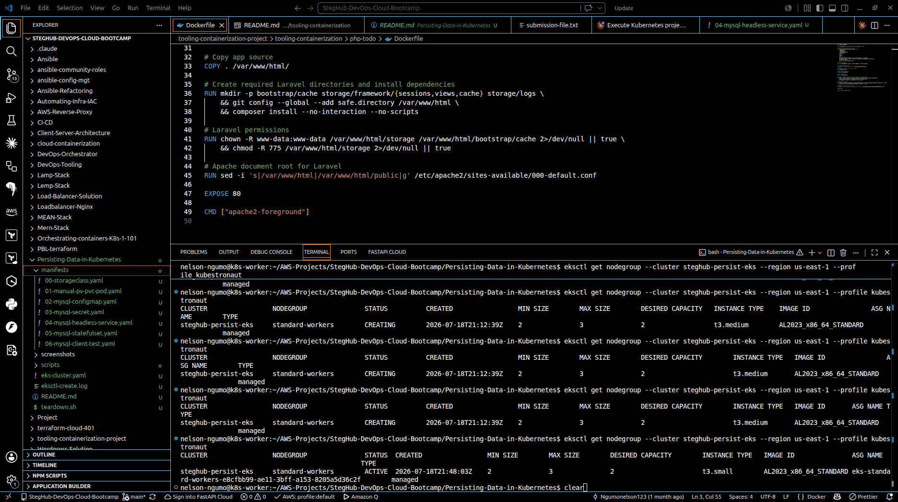
*`eksctl get nodegroup` history: `standard-workers` stuck `CREATING` on `t3.medium`, then `ACTIVE` on `t3.small` after the fix.*

Verify:

```bash
kubectl get nodes -o wide
```

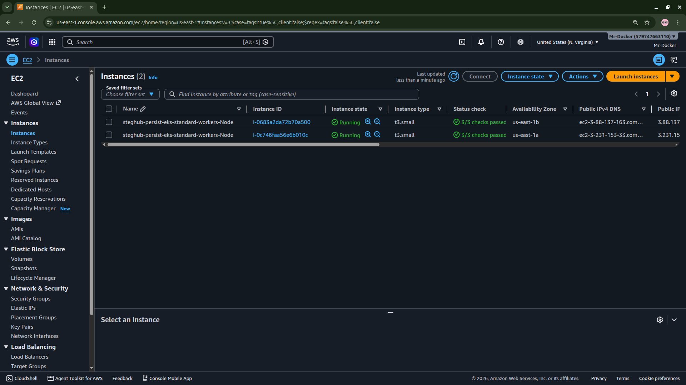
*EC2 console: both nodes `Running`, `t3.small`, split across `us-east-1a` and `us-east-1b`.*

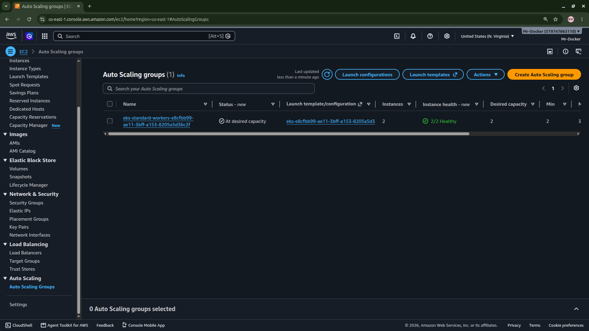
*The managed nodegroup's Auto Scaling group at "At desired capacity", 2/2 healthy.*

## 2. Install the EBS CSI driver

EKS 1.23+ removed the in-tree AWS EBS provisioner — dynamic provisioning
needs the `aws-ebs-csi-driver` addon plus an IRSA role so it can call the
EC2 API on your behalf.

```bash
cd scripts && ./install-ebs-csi-driver.sh
```

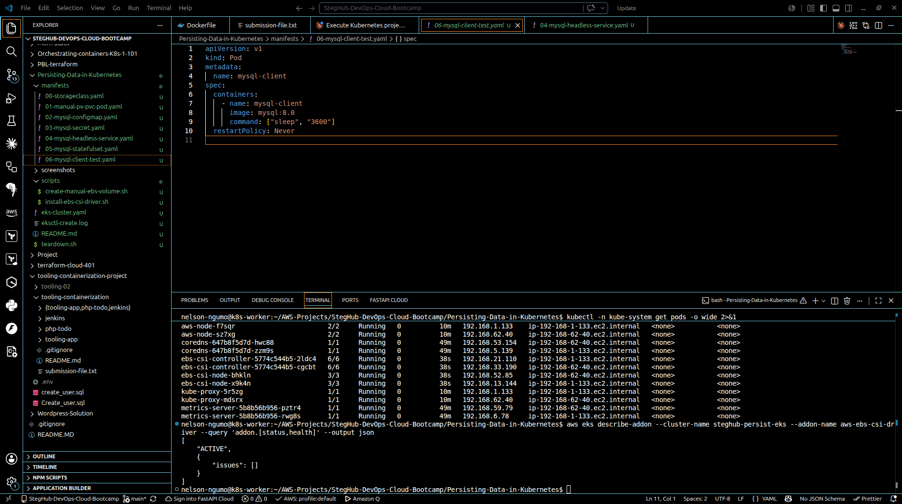
*`kube-system` pods showing `ebs-csi-controller`/`ebs-csi-node` Running, and `aws eks describe-addon` reporting the addon `ACTIVE`.*

## 3. Static/manual provisioning — and its limitation

Manually create an EBS volume and wire it to a Pod via a hand-written PV/PVC:

```bash
cd scripts && ./create-manual-ebs-volume.sh   # patches manifests/01-... with the real volume ID
kubectl apply -f manifests/01-manual-pv-pvc-pod.yaml
kubectl get pod nginx-manual-pv -o wide
```

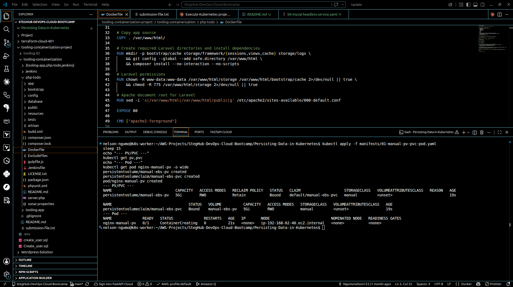
*PV and PVC bind immediately (`manual-ebs-pv` / `manual-ebs-pvc`), but the Pod sits in `ContainerCreating`.*

**The limitation, reproduced for real:** the volume was created in
`us-east-1a`, but the scheduler — with no AZ awareness baked into a
hand-written PV — placed `nginx-manual-pv` on the `us-east-1b` node. The
Pod sat in `ContainerCreating` and `kubectl describe pod` showed:

```
Warning  FailedAttachVolume  ...  api error InvalidVolume.ZoneMismatch:
The volume 'vol-0c4252e67ec239a38' is not in the same availability zone
as instance 'i-0683a2da72b70a500'
```

(Full output saved in `screenshots/static-pv-az-mismatch-evidence.txt`.)

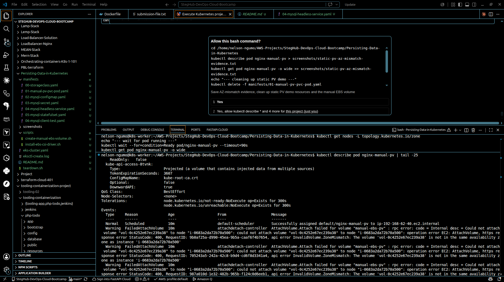
*`kubectl describe pod nginx-manual-pv`: repeated `FailedAttachVolume` / `InvalidVolume.ZoneMismatch` events.*

This is exactly why manually managing PVs doesn't scale, and why dynamic
provisioning with `volumeBindingMode: WaitForFirstConsumer` (see
`00-storageclass.yaml`) is the fix: the cloud provider now picks the AZ
*after* the scheduler has already placed the Pod, not before.

Cleaned up afterwards (Pod/PVC/PV deleted, manual EBS volume deleted).

## 4. Dynamic provisioning with a StatefulSet

```bash
kubectl apply -f manifests/00-storageclass.yaml
kubectl apply -f manifests/02-mysql-configmap.yaml
kubectl apply -f manifests/03-mysql-secret.yaml
kubectl apply -f manifests/04-mysql-headless-service.yaml
kubectl apply -f manifests/05-mysql-statefulset.yaml

kubectl get pods -l app=mysql -w
kubectl get pvc
kubectl get pv
```

Each StatefulSet replica gets its own PVC from `volumeClaimTemplates`
(`mysql-data-mysql-0`), dynamically provisioned as a real EBS volume in
whichever AZ the Pod actually landed in — no manual volume creation, no
AZ mismatch.

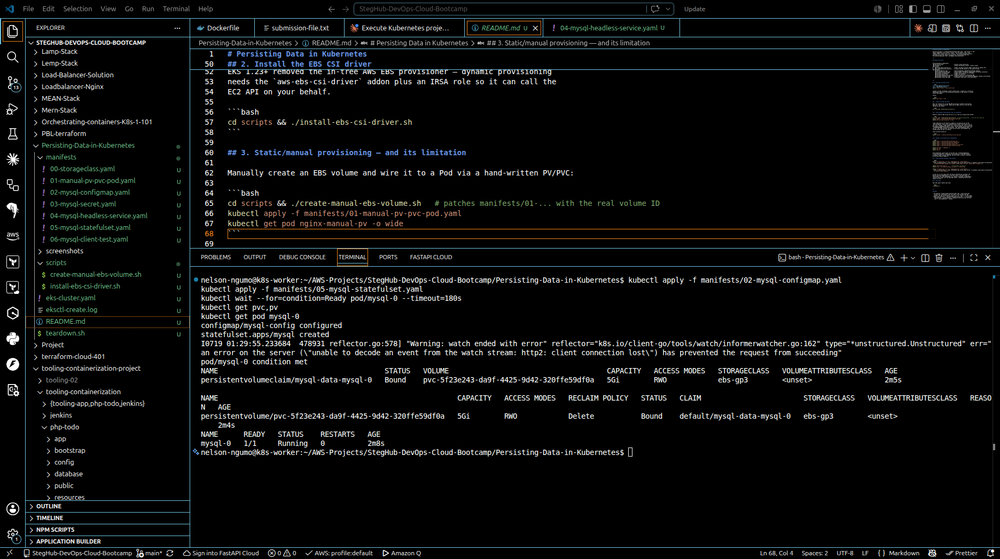
*First deploy looked fine at a glance (`mysql-0` `1/1 Running`) — except `RESTARTS 1`, the tell that something crashed during init. This is the broken-password state described below.*

> **Hit and fixed during this build:** the first version of
> `manifests/02-mysql-configmap.yaml` mounted two files into
> `/etc/mysql/conf.d/` — a leftover `primary.cnf`/`replica.cnf` pair from a
> primary/replica pattern that doesn't apply to a single-replica StatefulSet.
> `replica.cnf` set `super-read-only`, which blocked MySQL's entrypoint from
> executing the `ALTER USER` that sets the root password during first init,
> so `root` silently ended up with an **empty** password and every
> `mysql -uroot -p...` connection failed with `Access denied`. Fixed by
> collapsing the ConfigMap to a single `mysql.cnf` with no conflicting
> flags, then deleting the StatefulSet **and** its PVC (the volume had
> already initialized in the broken state) and redeploying clean.

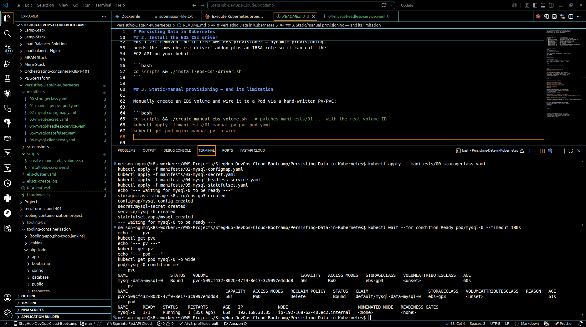
*After fixing the ConfigMap and redeploying against a fresh PVC (`pvc-5f23e243-...`): `mysql-0` `1/1 Running`, `RESTARTS 0`.*

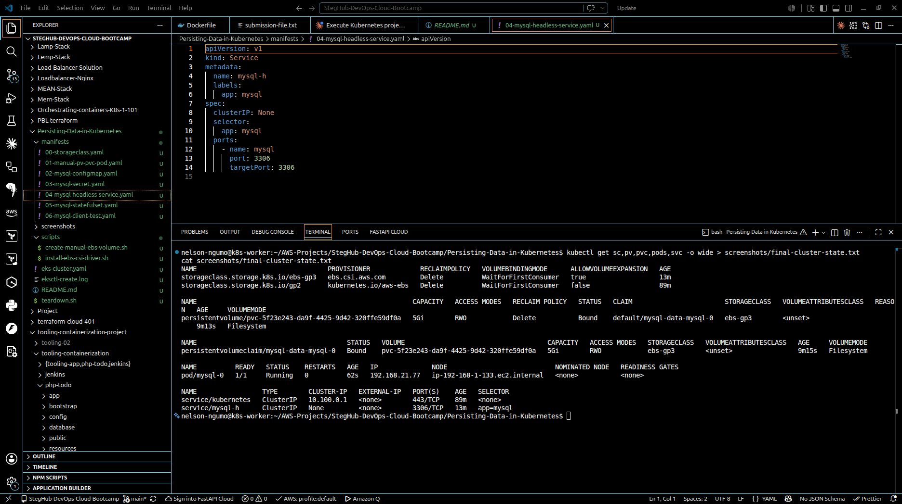
*`kubectl get sc,pv,pvc,pods,svc` — the whole stack in its steady state.*

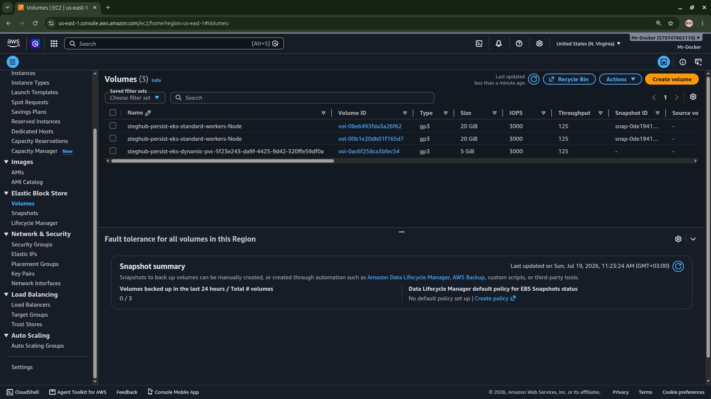
*AWS console cross-check: two 20 GiB node root volumes, plus the 5 GiB `steghub-persist-eks-dynamic-pvc-...` volume the EBS CSI driver created for the StatefulSet — no manual volume creation involved.*

## 5. Proof: data survives a Pod restart

```bash
ROOT_PW=$(kubectl get secret mysql-secret -o jsonpath='{.data.mysql-root-password}' | base64 -d)

kubectl exec mysql-0 -- mysql -uroot -p"${ROOT_PW}" -e \
  "CREATE DATABASE IF NOT EXISTS steghub; USE steghub;
   CREATE TABLE IF NOT EXISTS t (id INT); INSERT INTO t VALUES (1),(2),(3);
   SELECT * FROM t;"

kubectl get pvc mysql-data-mysql-0 -o jsonpath='{.spec.volumeName}'   # note the PV name

kubectl delete pod mysql-0                                            # StatefulSet recreates it
kubectl wait --for=condition=Ready pod/mysql-0 --timeout=120s

kubectl get pvc mysql-data-mysql-0 -o jsonpath='{.spec.volumeName}'   # same PV name

kubectl exec mysql-0 -- mysql -uroot -p"${ROOT_PW}" -e "SELECT * FROM steghub.t;"
```

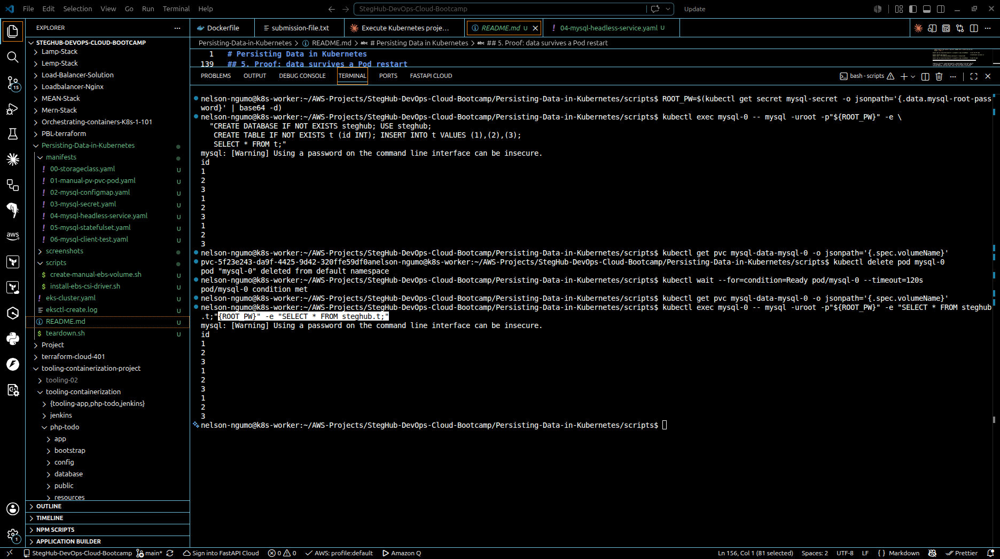
*Same `SELECT * FROM steghub.t` output before and after `kubectl delete pod mysql-0` — the StatefulSet recreated the Pod, the PVC/PV never moved, and the data is untouched.*

**Result:** the PVC (`mysql-data-mysql-0`) stayed bound to the exact same PV
(`pvc-5f23e243-...`) before and after the Pod was deleted, and the `SELECT`
returned identical rows both times. That's the core lesson — the PVC/PV
survives independently of the Pod, which is why StatefulSets (one PVC per
stable identity, via `volumeClaimTemplates`) are used for stateful
workloads instead of a Deployment (whose replicas would fight over the same
RWO volume with no stable per-replica storage at all).

## 6. Tear down

Real AWS spend — delete when done:

```bash
./teardown.sh
```

---

## Notes

- The separate `Orchestrating-containers-K8s-1-101` (from-scratch EC2
  cluster) was intentionally left torn down — this project uses EKS
  instead, per the course material which calls for `eksctl` at this stage.
- MySQL root password in `manifests/03-mysql-secret.yaml` is a placeholder
  (`PassWord123!`, base64-encoded) — regenerate before any real use with
  `echo -n 'yournewpassword' | base64`.
